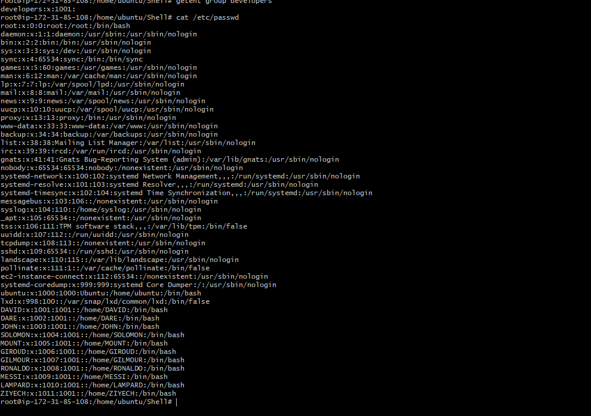

**AUX PROJECT 1: SHELL SCRIPTING**

**Create the project folder called Shell**

**projects code as follows**

**mkdir Shell**

**touch names.csv**

**vim names.csv**

**cd .ssh**

**touch id_rsa.pub**

**vi id_rsa.pub**

**touch id_rsa**

**vi id_rsa**

**connect to the server using the private key and the public key.**

